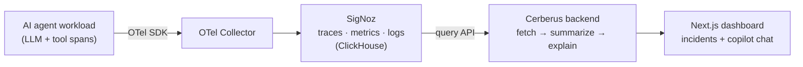

<div align="center">

# 🐺 Cerberus

**An AI SRE copilot that reads your agents' telemetry and tells you what broke, what it cost, and what to do.**

Emits *and* consumes [SigNoz](https://signoz.io/) — OpenTelemetry in, plain-English incident answers out.

[](https://github.com/CodeMuscle/cerberus/actions/workflows/ci.yml)
[](https://www.python.org/)
[](https://nextjs.org/)
[](https://signoz.io/)
[](#license)

</div>

---

AI agents fail in ways classic monitoring misses: a tool call silently retries, a prompt blows up token cost 4×, a judge step times out, an agent loops. Observability platforms show the data — nobody reads it *for* you.

**Cerberus** does. It instruments an AI-agent stack into SigNoz over OpenTelemetry, then an LLM copilot **reads those traces back** and answers *"what just went wrong?"* in plain English, citing the exact traces:

```text
Run 8f2c1 failed at the judge step (timed out 3×). Token use spiked to 4,080
(≈13× the healthy baseline) on an oversized prompt, so cost jumped too.
→ trace_id 8f2c1 · flags: error, token_spike
```

Three heads, three signals: **traces · metrics · logs**.

## Why it's different

Most observability projects only *emit* telemetry. Cerberus **emits and consumes** it — the agent-native loop of an agent observing agents. The copilot's reasoning runs on deterministic incident facts computed *before* the LLM (errors, token/cost spikes, latency), so answers are grounded, not hallucinated.

## Architecture



## Tech stack

| Layer | Choice |
|---|---|
| **Backend** | Python 3.11 · FastAPI · Pydantic · httpx |
| **Telemetry** | OpenTelemetry (SDK + OTLP exporter) → SigNoz query API |
| **Copilot** | LLM over deterministic incident facts (injectable — local Llama or hosted) |
| **Frontend** | Next.js 15 · React · TypeScript · Tailwind · shadcn/ui · Recharts |
| **Quality** | ruff · mypy · pytest + coverage · ESLint · Prettier · pre-commit · GitHub Actions |

## Monorepo layout

```text
cerberus/            Python backend (the copilot brain)
├── model.py         Span + the single SigNoz-shape adapter
├── analyze.py       deterministic incident facts (errors, spikes, ranking)
├── copilot.py       LLM analyst → grounded, trace-cited answer (injectable)
├── signoz_client.py SigNoz query-API reader (Day-1: pin the endpoint)
└── api.py           FastAPI — /incidents · /ask
web/                 Next.js + shadcn/ui dashboard
sandbox/             OTel demo agent (emits traces to SigNoz) + query probe
tests/               pytest — pure units, no network, no LLM (injected deps)
```

## Quickstart

### Backend
```bash
uv venv && source .venv/bin/activate
uv pip install -e ".[dev]"
pytest                     # pure units, offline
uvicorn cerberus.api:app --port 8030
```

### Frontend
```bash
cd web
npm install
npm run dev                # http://localhost:3000
```

### Telemetry sandbox (produces traces to observe)
See [`sandbox/README.md`](sandbox/README.md): start SigNoz (Docker) → run the demo agent → confirm the query API.

## Development

```bash
make install     # backend + frontend deps
make lint        # ruff + eslint
make fmt         # ruff format + prettier
make test        # pytest (+coverage)
make run         # backend on :8030
make web         # frontend on :3000
```

## Status

- ✅ **Backend copilot core** — `model` · `analyze` · `copilot`, fully unit-tested (no network, no LLM).
- 🔜 `signoz_client` (pin the SigNoz query API), FastAPI routes, Next.js dashboard.

Design + plan: [`docs/`](docs/).

## Acknowledgements

Built on [**SigNoz**](https://signoz.io/) (OpenTelemetry-native observability) and [**OpenTelemetry**](https://opentelemetry.io/). The contradiction-grounding pattern is carried over from [Crosscheck/Argus](https://github.com/CodeMuscle/crosscheck).

## License

MIT — see [LICENSE](LICENSE).
