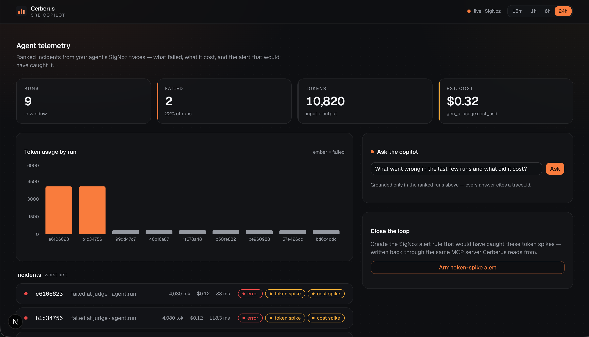
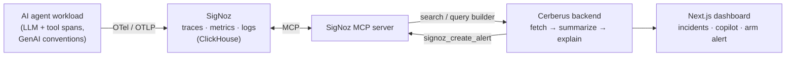

<div align="center">

#  Cerberus

**An AI SRE copilot that reads your agent's telemetry and tells you what broke, what it cost, and what to do.**

Emits *and* consumes [SigNoz](https://signoz.io/) — OpenTelemetry in, plain-English incident answers out, and the alert that would have caught it back.

[Dashboard](https://cerberus-sre.vercel.app/dashboard)

[](https://github.com/CodeMuscle/cerberus/actions/workflows/ci.yml)
[](https://www.python.org/)
[](https://nextjs.org/)
[](https://signoz.io/)
[](#license)

<br/>



</div>

---

AI agents fail in ways classic monitoring misses: a tool call silently retries, a prompt blows up token cost 4×, a judge step times out, an agent loops. Observability platforms show the data — nobody reads it *for* you.

**Cerberus** does. An AI-agent workload is instrumented into SigNoz over OpenTelemetry; Cerberus then **reads those traces back through the SigNoz MCP server**, ranks every run by failure and spend, and a copilot answers *"what just went wrong?"* in plain English, citing the exact traces:

```text
Run e810dd93 failed at the judge step. Input tokens spiked to 4,000 on an
oversized prompt (baseline ~300), pushing cost to $0.12 for the run.
→ trace_id e810dd93 · flags: error, token_spike, cost_spike
```

Then it closes the loop: one click creates the SigNoz **alert rule** that would have caught the incident — written back through the same MCP server it reads from.

## Why it's different

Most observability projects only *emit* telemetry. Cerberus **emits, consumes, and acts** — the agent-native loop of an agent observing agents:

- **Observe** — every run lands in SigNoz as OpenTelemetry traces (token usage, cost, latency, errors, per step).
- **Explain** — the copilot reasons over **deterministic incident facts computed before the LLM** (errors, token/cost spikes, latency, ranking), so answers are grounded and trace-cited, not hallucinated.
- **Prevent** — it creates the SigNoz alert rule for the incident's root cause via the MCP server.

The read path speaks **MCP** — the same tool surface an AI client gets (`signoz_execute_builder_query`, `signoz_create_alert`, …) is the surface Cerberus is built on.

## Architecture



Emit side = the demo agent in [`sandbox/`](sandbox/). Read + act side = the `cerberus/` package, entirely over MCP.

## Best use of SigNoz

Cerberus leans on SigNoz deeply, not just as a sink:

- **SigNoz MCP server** — the whole read/write path. Deployed by Foundry (`mcp.spec.enabled`).
- **Query Builder v5** (`signoz_execute_builder_query`) — projects the `gen_ai.usage.*` token/cost attributes the fixed trace projection omits.
- **Alerts** (`signoz_create_alert`) + **notification channels** — the closer creates a `TRACES_BASED` threshold rule over `max(gen_ai.usage.input_tokens)`.
- **Foundry** — one-command, reproducible deployment; `casting.yaml` and `casting.yaml.lock` are committed so judges can re-run it.

## Quickstart

### 1. Deploy SigNoz + the MCP server (one command)

```bash
curl -fsSL https://signoz.io/foundry.sh | bash
foundryctl cast -f casting.yaml     # SigNoz on :8080, MCP on :8000
```

Then create a service-account API key in SigNoz (Settings → Service Accounts, Admin role) and add it to `.env`:

```bash
echo 'SIGNOZ_API_KEY=<your-key>' >> .env
```

### 2. Backend

```bash
uv venv && uv pip install -e ".[dev]"
pytest                               # 18 pure units, offline
uvicorn cerberus.api:app --port 8030
```

### 3. Frontend

```bash
cd web && npm install && npm run dev # http://localhost:3000
```

### 4. Generate traffic to observe

```bash
cd sandbox && uvicorn app:app --port 8090
curl "localhost:8090/run"            # healthy run
curl "localhost:8090/run?fail=1"     # forced incident (token + cost spike)
```

Open the dashboard → incidents rank worst-first, ask the copilot, arm the alert.

For the copilot's LLM, set `ANTHROPIC_API_KEY` for Claude (best quality); without it, it falls back to a local Ollama model. Deployment details, env vars, and the Vercel setup are in [`DEPLOY.md`](DEPLOY.md).

## Repo layout

```text
casting.yaml(.lock)  Foundry deployment — SigNoz + MCP server (reproducible)
cerberus/            Python backend
├── model.py         Span + the SigNoz-shape adapter (MCP + legacy rows)
├── analyze.py       deterministic incident facts (errors, spikes, ranking)
├── copilot.py       LLM analyst → grounded, trace-cited answer (Claude / Ollama)
├── signoz_client.py MCP client — Query Builder v5 read path (injectable transport)
├── alerts.py        the closer — builds + arms the SigNoz alert rule
└── api.py           FastAPI — /incidents · /ask · /guard · /health
web/                 Next.js dashboard (/dashboard) + marketing site (/)
sandbox/             OTel demo agent emitting GenAI-convention spans
tests/               pytest — pure units, no network, no LLM (injected deps)
```

## Tech stack

| Layer | Choice |
|---|---|
| **Backend** | Python 3.11 · FastAPI · Pydantic · httpx · MCP SDK |
| **Telemetry** | OpenTelemetry (SDK + OTLP) → SigNoz, read back over the SigNoz MCP server |
| **Copilot** | Claude (Anthropic) over deterministic incident facts; injectable, local-Ollama fallback |
| **Deploy** | Foundry (`foundryctl cast`) for SigNoz + MCP · Vercel for the frontend |
| **Frontend** | Next.js 16 · React · TypeScript · Tailwind · shadcn/ui · Recharts |
| **Quality** | ruff · mypy · pytest + coverage · ESLint · GitHub Actions CI |

## Disclosures

**AI assistance.** Cerberus was built with the help of AI coding assistants (Claude / Claude Code), as permitted by the hackathon rules and disclosed here.

**Pre-hackathon scaffold.** This repository was created on 2026-07-06 with the project spec, implementation plan, and production scaffold — packaging, CI, the Next.js shell, and the offline copilot core (`model` / `analyze` / `copilot`) — as pre-hackathon preparation. All hackathon feature work — the Foundry deployment, the MCP-based read path, the Query Builder integration, the alert-creation closer, the live dashboard, and the marketing site — was built during the hackathon window (Jul 20–26 2026). The commit history reflects this split.

## Acknowledgements

Built on [**SigNoz**](https://signoz.io/) (OpenTelemetry-native observability), [**OpenTelemetry**](https://opentelemetry.io/), and [**Foundry**](https://github.com/SigNoz/foundry). The grounded-reasoning pattern (deterministic facts before the LLM) is carried over from [Crosscheck/Argus](https://github.com/CodeMuscle/crosscheck).

## License

MIT — see [LICENSE](LICENSE).
